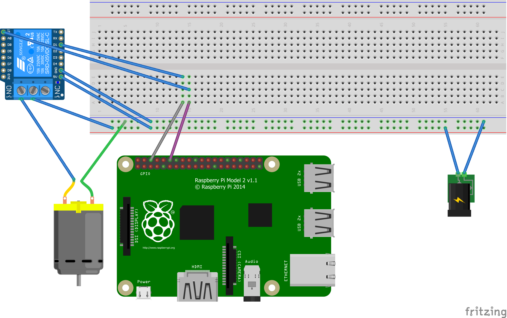

# Watering #

Simple App for watering my balcony plants

- Python backend communicating with the hardware through wiringpi and exposing an REST api using [falcon](https://falconframework.org/).
- [Angular](https://angular.io/) frontend to water the plants and track how much water is left in the can.

## Wiring



## Installation

The python backend is run by gunicorn which is fired up by supervisor.

    sudo apt-get install python python-pip supervisor
    sudo pip install gunicorn
  

`/etc/supervisor/conf.d/watering.conf` 

````
[program:watering]
command=/usr/local/bin/gunicorn -b '0.0.0.0:8087' --timeout 3600 water:app
directory=/home/janm/watering/py
user=root
autostart=true
autorestart=true
stderr_logfile=/var/log/watering.err.log
stdout_logfile=/var/log/watering.out.log
````

The angular frontend and the REST interface run by gunicorn are served by nginx.

    sudo apt-get install nginx
    
`/etc/nginx/sites-available/default`

````
upstream app_server {
    # fail_timeout=0 means we always retry an upstream even if it failed
    # to return a good HTTP response

    # for UNIX domain socket setups
    #server unix:/tmp/gunicorn.sock fail_timeout=0;

    # for a TCP configuration
    server 127.0.0.1:8087 fail_timeout=0;
  }

server {
	listen 80 default_server;
	listen [::]:80 default_server;

	root /var/www/html;
	index index.html;

	location /watering/ {
		alias /var/www/html/watering/;
	}

	location /watering.api/ {
		proxy_set_header X-Forwarded-For $proxy_add_x_forwarded_for;
		proxy_set_header Host $http_host;
		proxy_redirect off;
		proxy_pass http://app_server;
		proxy_connect_timeout       3600;
		proxy_send_timeout          3600;
		proxy_read_timeout          3600;
		send_timeout                3600;
  }
}
````
